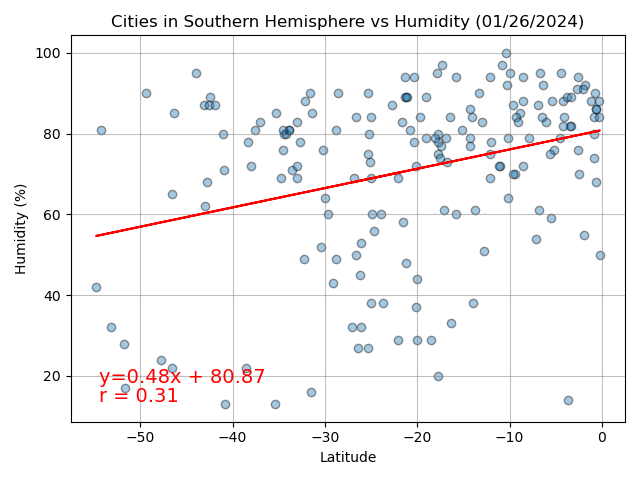

# Module6_API-Challenge
API Challenge - Week 6 - Data Analytics Boot Camp - University of Oregon

## API Challenge Description
Data's true power is its ability to definitively answer questions. So, I'm taking what I've learned about Python requests, APIs, and JSON traversals to answer a fundamental question: "What is the weather like as we approach the equator?"

Now, I know what you may be thinking: “That’s obvious. It gets hotter.” But, if pressed for more information, how would I prove that?

## Instructions
- **Part 1:  WeatherPy**
  - Create plots to showcase the relationship between the following:  
    - Latitude vs. Temperature
    - Latitude vs. Humidity
    - Latitude vs. Cloudiness
    - Latitude vs. Wind Speed
  - Divide the cities between northern and southern hemisphere and compute linear regression for each relationship.
- **Part 2:  VacationPy**
  - Create a map that displays a point for every city.  The size of the point should be the humidity in each city.
  - Narrow down city data to find your ideal weather condition. 
  - For each city, find a hotel located within 10,000 meters of your coordinates.
  - Add the hotel name and the country as additional information in the hover message.

## Analysis:  WeatherPy

###  Temperature vs. Latitude Linear Regression Plot
In the northern hemisphere, we can see a strong negative correlation (r = -0.84) between latitude and temperature.  Cities closer to 0 degrees latitude (the equator) experience warmer, while those situated at higher latitude show a more pronounced cooling trend.

The southern hemisphere shows a positive correlation (r = 0.38) between latitude and temperature.  As with the northern hemisphere, cities closer to the equator experience warmer weather and cities that move away from the equator experience cooler weather.  It is worth noting that the correlation is comparatively weaker than the northern hemisphere.  

The difference in correlation strengths could be explained by the earth’s tilt during this time of year (1/26/2024).  The southern hemisphere is transitioning from summer to fall and is likely experiencing more temperate climate.  Whereas the northern hemisphere is tilted away from the sun where the difference in temperatures are more significant between cities as we move further north.

### Humidity vs. Latitude Linear Regression Plot

In the northern hemisphere, we can see a moderate positive correlation between humidity and latitude, with an r-value of 0.47.  This data suggests that as cities are further away from the equator, humidity tends to increase.  A similar, but weaker, positive correlation with an r-value of 0.31 was observed in the southern hemisphere.    It is unusual for both the northern and southern hemispheres show positive correlation, which is contrary to the expected inverse relationship between hemispheres.

This unexpected result raises question as to whether this pattern is coincidence as it is a snapshot in time (1/26/2024).  External factors, such as storms or other weather conditions, could be influencing these results.  Additional study over an extended period of time would be needed to determine if a consistent correlation exists. 

### Cloudiness vs. Latitude Linear Regression Plot

In both the northern and southern hemispheres, there is a noticeable but weak correlation between cloudiness and latitude. The northern hemisphere exhibits a weak positive correlation with an r-value of 0.28, while the southern hemisphere displays a similar weak positive correlation with an r-value of 0.25. Given the anticipation of an inverse relationship between the two hemispheres, the observed weak positive correlations, along with their modest r-values, suggest that a long-term correlation between cloudiness and latitude is unlikely.

### Wind Speed vs. Latitude Linear Regression Plot

In the northern hemisphere, there appears to be a near-zero correlation between wind speed and latitude, indicated by an r-value of -0.01. However, the southern hemisphere exhibits a moderate negative correlation with a calculated r-value of -0.37.  The northern and southern hemispheres typically demonstrate an inverse relationship.  Given that the northern hemisphere shows a near zero correlation between wind speed and latitude, and the southern hemisphere has a moderate correlation, raises question as to whether this is coincidence.  The inconsistent results could be influenced by external factors such as localized storms or other weather anomalies in the southern hemisphere. Since this is a snapshot in time (1/26/2024), additional study over an extended period of time would be needed to determine if a consistent correlation exists.

## Analysis:  VacationPy

The first map, I plotted every city in the WeatherPy project onto a map using the Geoapify API.  Each city on the map is represented by a unique color. The size of each city's marker is proportional to the humidity recorded at the time of data collection, providing a visual representation of humidity across the cities.

For the second map, I refined the selection of cities to match my preferred weather conditions:
- Temperature range between 20 and 32 degrees Celsius.
- Humidity below 20%
- Less than 20% cloud cover

I also identified hotels for each chosen city located within a 10,000 meter radius of the coordinates. The resulting map displays these selected cities, and when hovering over each city, details such as longitude, latitude, city name, humidity, hotel name, and country are also presented.

